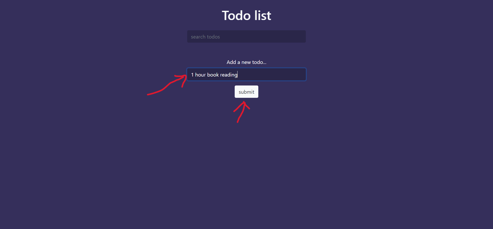

## website link
click [here](https://sumanislam.github.io/To-do-list-2/) to see the Live preview of the website

## Introduction
This is a simple __TODO__ aplication developed with html, css and JavaScript. You can add a __TODO__, remove a __TODO__, search a __TODO__ or if you have lots of __TODO__ you can clear them all at one click.

## Landing Page

## Add TODO
Write down your task and press __Enter__ or click on __Submit__ button.

## Remove TODO
To remove a __TODO__ click on __Remove__ icon.

## Search TODO

## Clear TODOS

